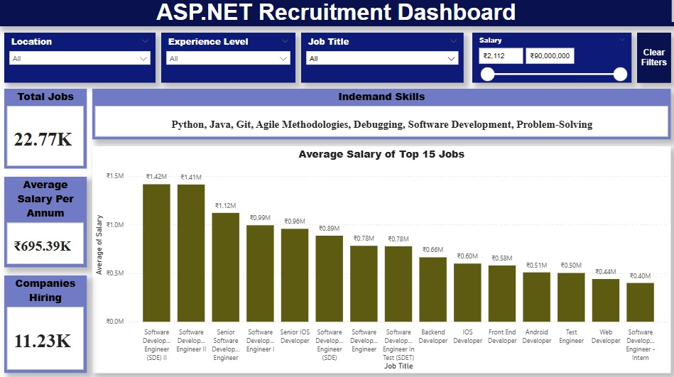

# ASP.NET Employability Analytics Dashboard

> A dynamic Power BI dashboard designed to empower recruitment managers and job seekers with data-driven insights for efficient ASP.NET developer hiring.

---

## 📖 Project Overview

This project presents an intelligent recruitment dashboard tailored for ASP.NET developer roles. Built using Power BI and driven by cleaned and validated datasets, it offers real-time insights into hiring trends, salary benchmarks, hiring risks, recruiter responsiveness, and candidate-job fit.

Whether you're a hiring lead aiming to reduce recruitment inefficiencies, or a job seeker trying to identify the right opportunity, this dashboard simplifies decision-making with interactive visuals and actionable data.

---

## 📚 Table of Contents

- [Project Overview](#-project-overview)
- [Key Objectives](#-key-objectives)
- [Dashboard Snapshots](#-dashboard-snapshots)
  - [Dashboard Overview](#dashboard-overview)
  - [Hiring Trends](#hiring-trends)
  - [Hiring Risks](#hiring-risks)
  - [Recruitment Efficiency](#recruitment-efficiency)
  - [Candidate-Job Fit](#candidate-job-fit)
  - [Salary Benchmarking](#salary-benchmarking)
- [Tools & Technologies](#-tools--technologies)
- [Features](#-features)
- [Project Structure](#-project-structure)
- [Contributors](#-contributors)
- [How to Use](#-how-to-use)
- [Use Cases](#-use-cases)
- [License](#-license)

---

## 💡 Key Objectives

- Assist **recruitment managers** in identifying optimal hiring strategies
- Help **job seekers** align their skills and qualifications with market expectations
- Streamline decision-making through **visual storytelling**
- Validate job market trends using data sourced and synthesized for ASP.NET roles

---

## 📊 Dashboard Snapshots

### Dashboard Overview

A summary view of job listings, average salaries, and top hiring companies.

### Hiring Trends

Explore how demand fluctuates across locations and experience levels.

### Hiring Risks

Identify job listings associated with low skill demand, delayed recruiter responses, and below-average salaries.

### Recruitment Efficiency

Compare salary, skill demand, and recruiter responsiveness to gauge efficiency by role and region.

### Candidate-Job Fit

Analyze how experience levels, education requirements, and skills align with job expectations.

### Salary Benchmarking

Compare compensation by skill demand, experience, and company.

---

## 🧰 Tools & Technologies

- **Power BI** – For dashboard creation and publishing
- **Excel / SQL** – For data cleaning, validation, and transformation
- **DAX (Data Analysis Expressions)** – For calculated columns and KPIs
- **Dataset** – Customized and scaled for employability analytics

---

## 🚀 Features

- 📍 Real-time hiring insights with slicers for location, experience, role, and job domain
- 📊 Salary analysis by company, skill demand, and experience level
- 🕒 Recruiter response time distribution and slow company identification
- 📌 Skill demand mapping and job-level fit analysis
- 🧠 Intelligent recommendations for job seekers and recruiters
- 🔄 Exportable views and interactive exploration

---

## 🗂 Project Structure

- `Dashboard.pbix` – Main Power BI file
- `Validation.pdf` – Pdf file for transformations and data checks
- `README.md` – Project documentation
- `*.jpeg` – Screenshots of all dashboard pages

---

## 👥 Contributors

- **Pallavi Gosu**
- **Manohar Gopagani**
- **Sanitha Guduru**
- **Preethi Gouda**
- **Vaishnavi Gopisetty**

---

## 🛠 How to Use

1. Download and open the `.pbix` file in Power BI Desktop.
2. Use the top slicers to filter job roles, experience levels, and domains.
3. Navigate through the different pages using the bottom tabs.
4. Export any visuals or pages using Power BI’s export functionality.

---

## 📌 Use Cases

- **For Hiring Leads**: Find companies with delayed responses, avoid low-skill job listings, and benchmark salaries.
- **For Job Seekers**: Identify companies with better pay, required skills for ASP.NET roles, and matching job-education criteria.

---

## 📜 License

This dashboard project was developed as part of the IS-5960 course at Saint Louis University and is intended for academic and educational purposes only.
